# Dynamic Terrain Layout Atlas

This atlas is generated from `dynamic_terrain_suites.py`.
It is a top-down design preview, not an Isaac Gym render.

Color meaning:

- Red: moving hurdle
- Blue: changing step height
- Green: shifting gap takeoff/landing platforms
- Purple: time-varying ramp

## pure_hurdle

### Layout 0: `single_barrier_course` (easy)

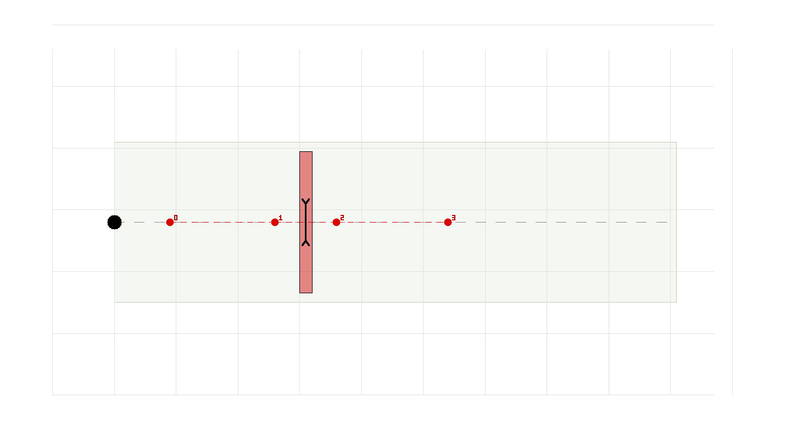

Metadata: runup=1.0, runout=1.1, corridor_half_width=0.65

| obstacle | type | base_position | size | motion |
|---|---|---|---|---|
| `easy_hurdle_barrier` | `moving_hurdle` | `[1.55, 0.0, 0.3]` | `[0.1, 1.15, 0.3]` | `axis=y, amp=[0.06, 0.16], freq=[0.08, 0.22]` |

### Layout 1: `double_barrier_course` (medium)

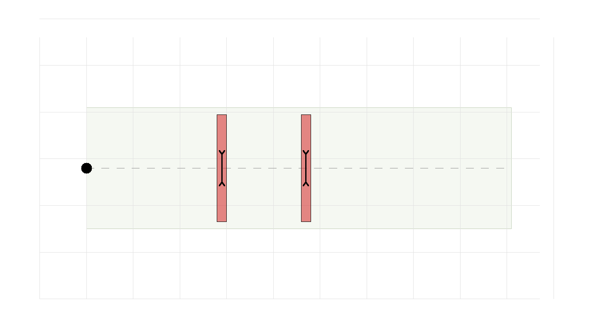

Metadata: runup=1.0, runout=1.1, corridor_half_width=0.65

| obstacle | type | base_position | size | motion |
|---|---|---|---|---|
| `medium_hurdle_entry` | `moving_hurdle` | `[1.45, 0.0, 0.31]` | `[0.1, 1.15, 0.31]` | `axis=y, amp=[0.07, 0.18], freq=[0.08, 0.24]` |
| `medium_hurdle_exit` | `moving_hurdle` | `[2.35, 0.0, 0.36]` | `[0.1, 1.15, 0.36]` | `axis=y, amp=[0.08, 0.2], freq=[0.09, 0.26]` |

### Layout 2: `staggered_barrier_course` (hard)

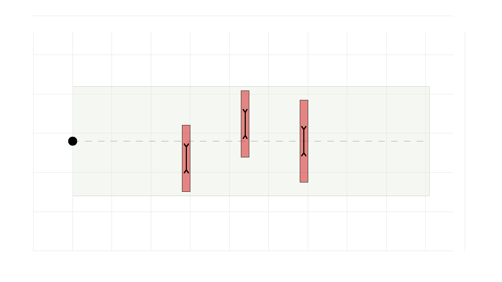

Metadata: runup=1.0, runout=1.15, corridor_half_width=0.7

| obstacle | type | base_position | size | motion |
|---|---|---|---|---|
| `hard_hurdle_left` | `moving_hurdle` | `[1.45, -0.22, 0.32]` | `[0.1, 0.85, 0.32]` | `axis=y, amp=[0.06, 0.17], freq=[0.08, 0.24]` |
| `hard_hurdle_right` | `moving_hurdle` | `[2.2, 0.22, 0.38]` | `[0.1, 0.85, 0.38]` | `axis=y, amp=[0.08, 0.22], freq=[0.1, 0.28]` |
| `hard_hurdle_center` | `moving_hurdle` | `[2.95, 0.0, 0.34]` | `[0.1, 1.05, 0.34]` | `axis=y, amp=[0.05, 0.16], freq=[0.08, 0.22]` |

### Layout 3: `multi_hurdle_short_course` (hardest)

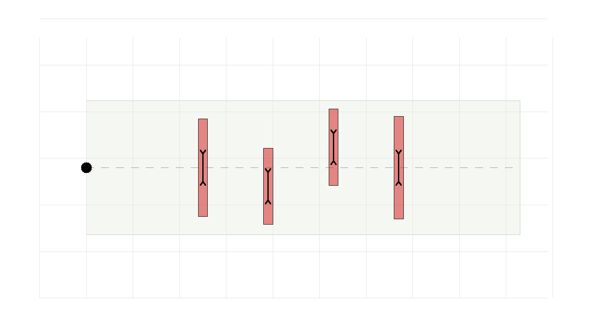

Metadata: runup=0.9, runout=1.2, corridor_half_width=0.72

| obstacle | type | base_position | size | motion |
|---|---|---|---|---|
| `multi_hurdle_1` | `moving_hurdle` | `[1.25, 0.0, 0.3]` | `[0.1, 1.05, 0.3]` | `axis=y, amp=[0.05, 0.16], freq=[0.08, 0.24]` |
| `multi_hurdle_2` | `moving_hurdle` | `[1.95, -0.2, 0.34]` | `[0.1, 0.82, 0.34]` | `axis=y, amp=[0.06, 0.18], freq=[0.09, 0.26]` |
| `multi_hurdle_3` | `moving_hurdle` | `[2.65, 0.22, 0.38]` | `[0.1, 0.82, 0.38]` | `axis=y, amp=[0.07, 0.2], freq=[0.1, 0.3]` |
| `multi_hurdle_4` | `moving_hurdle` | `[3.35, 0.0, 0.35]` | `[0.1, 1.1, 0.35]` | `axis=y, amp=[0.05, 0.16], freq=[0.08, 0.24]` |

## pure_step

### Layout 0: `two_level_step` (easy)

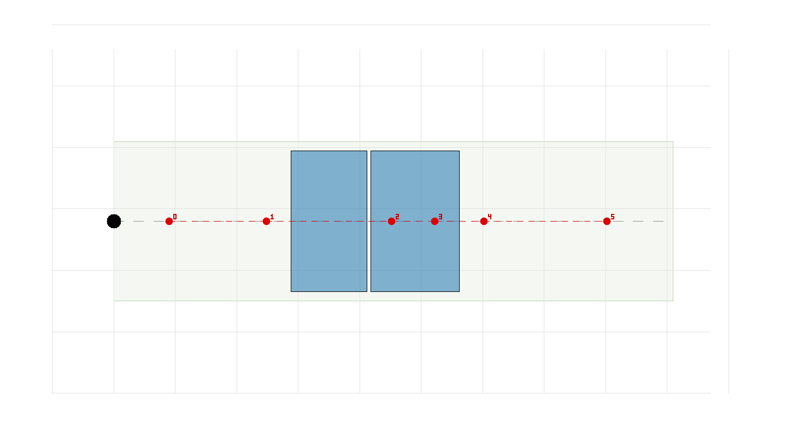

Metadata: runup=1.0, runout=1.2, corridor_half_width=0.65

| obstacle | type | base_position | size | motion |
|---|---|---|---|---|
| `two_level_step_lower` | `changing_step_height` | `[1.75, 0.0, 0.12]` | `[0.62, 1.15, 0.12]` | `axis=z, amp=[0.02, 0.08], freq=[0.05, 0.2]` |
| `two_level_step_upper` | `changing_step_height` | `[2.45, 0.0, 0.24]` | `[0.72, 1.15, 0.24]` | `axis=z, amp=[0.02, 0.09], freq=[0.05, 0.2]` |

### Layout 1: `three_step_staircase` (medium)

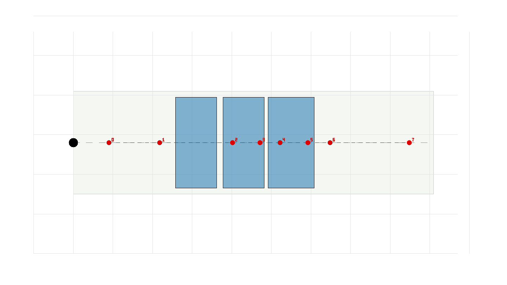

Metadata: runup=0.95, runout=1.2, corridor_half_width=0.65

| obstacle | type | base_position | size | motion |
|---|---|---|---|---|
| `stair_step_1` | `changing_step_height` | `[1.55, 0.0, 0.1]` | `[0.52, 1.15, 0.1]` | `axis=z, amp=[0.015, 0.06], freq=[0.05, 0.18]` |
| `stair_step_2` | `changing_step_height` | `[2.15, 0.0, 0.18]` | `[0.52, 1.15, 0.18]` | `axis=z, amp=[0.02, 0.08], freq=[0.05, 0.2]` |
| `stair_step_3` | `changing_step_height` | `[2.75, 0.0, 0.26]` | `[0.58, 1.15, 0.26]` | `axis=z, amp=[0.02, 0.09], freq=[0.06, 0.22]` |

### Layout 2: `offset_staircase` (hard)

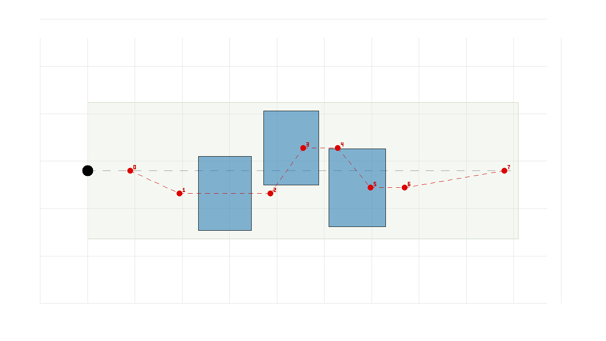

Metadata: runup=0.95, runout=1.25, corridor_half_width=0.72

| obstacle | type | base_position | size | motion |
|---|---|---|---|---|
| `offset_stair_left_1` | `changing_step_height` | `[1.45, -0.24, 0.12]` | `[0.56, 0.78, 0.12]` | `axis=z, amp=[0.02, 0.08], freq=[0.05, 0.22]` |
| `offset_stair_right_2` | `changing_step_height` | `[2.15, 0.24, 0.2]` | `[0.58, 0.78, 0.2]` | `axis=z, amp=[0.02, 0.1], freq=[0.05, 0.25]` |
| `offset_stair_left_3` | `changing_step_height` | `[2.85, -0.18, 0.28]` | `[0.6, 0.82, 0.28]` | `axis=z, amp=[0.02, 0.09], freq=[0.06, 0.24]` |

### Layout 3: `increasing_platform_sequence` (hardest)

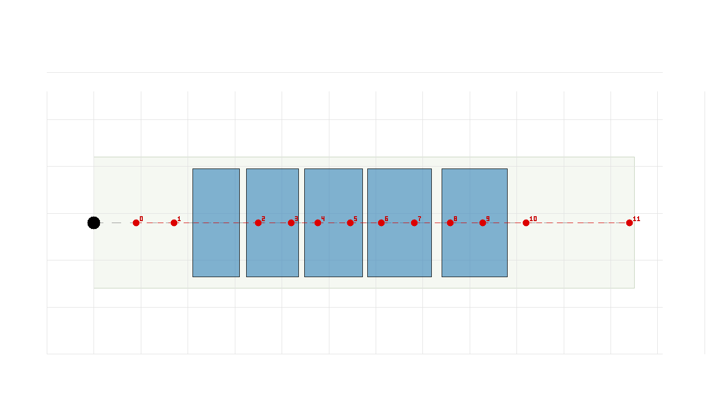

Metadata: runup=0.9, runout=1.3, corridor_half_width=0.7

| obstacle | type | base_position | size | motion |
|---|---|---|---|---|
| `platform_entry_step` | `changing_step_height` | `[1.45, 0.0, 0.12]` | `[0.55, 1.15, 0.12]` | `axis=z, amp=[0.02, 0.08], freq=[0.08, 0.22]` |
| `platform_mid_step` | `changing_step_height` | `[2.15, 0.0, 0.22]` | `[0.75, 1.15, 0.22]` | `axis=z, amp=[0.02, 0.09], freq=[0.06, 0.22]` |
| `platform_exit_step` | `changing_step_height` | `[3.0, 0.0, 0.3]` | `[0.78, 1.15, 0.3]` | `axis=z, amp=[0.03, 0.1], freq=[0.08, 0.25]` |

## pure_gap

### Layout 0: `short_platform_gap` (easy)

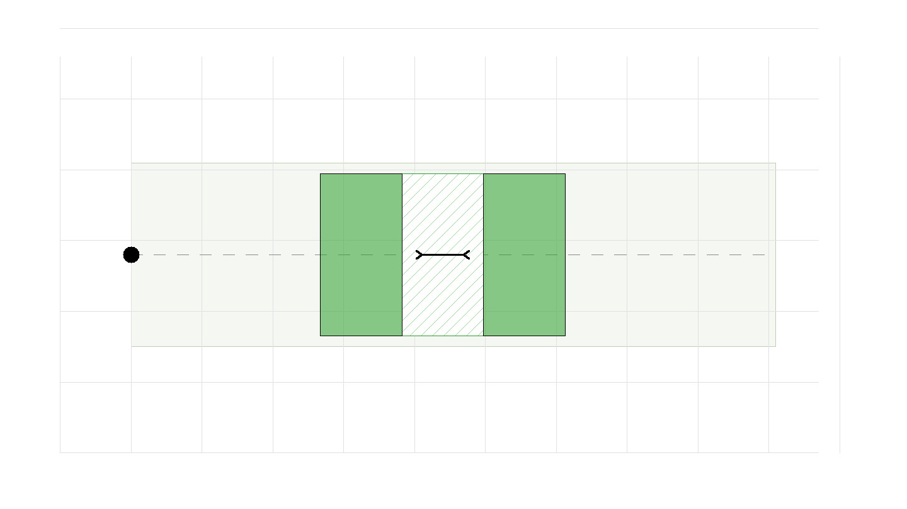

Metadata: runup=1.0, runout=1.2, corridor_half_width=0.65

| obstacle | type | base_position | size | motion |
|---|---|---|---|---|
| `short_platform_gap` | `shifting_gap` | `[2.2, 0.0, 0.1]` | `[0.58, 1.15, 0.1]` | `axis=x, amp=[0.05, 0.18], freq=[0.05, 0.2]` |

### Layout 1: `medium_platform_gap` (medium)

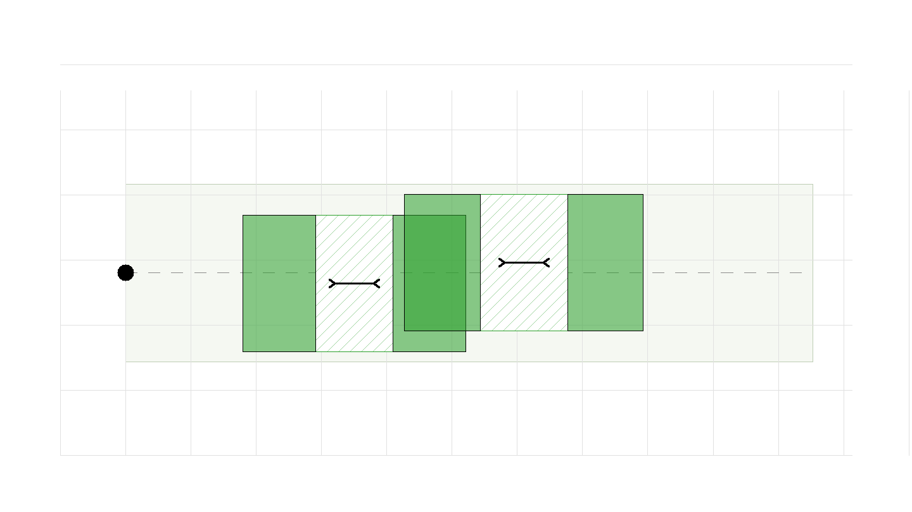

Metadata: runup=1.0, runout=1.25, corridor_half_width=0.68

| obstacle | type | base_position | size | motion |
|---|---|---|---|---|
| `medium_platform_gap` | `shifting_gap` | `[2.35, 0.0, 0.1]` | `[0.6, 1.2, 0.1]` | `axis=x, amp=[0.04, 0.14], freq=[0.05, 0.18]` |

### Layout 2: `wide_platform_gap` (hard)

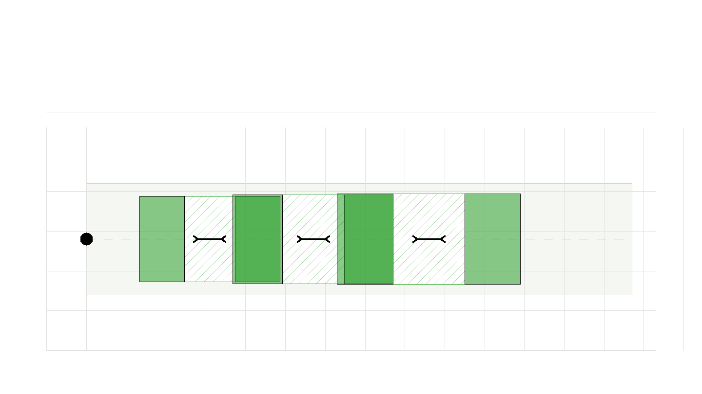

Metadata: runup=1.0, runout=1.35, corridor_half_width=0.7

| obstacle | type | base_position | size | motion |
|---|---|---|---|---|
| `wide_platform_gap` | `shifting_gap` | `[2.55, 0.0, 0.1]` | `[0.8, 1.2, 0.1]` | `axis=x, amp=[0.05, 0.15], freq=[0.04, 0.16]` |

### Layout 3: `repeated_staggered_gaps` (hardest)

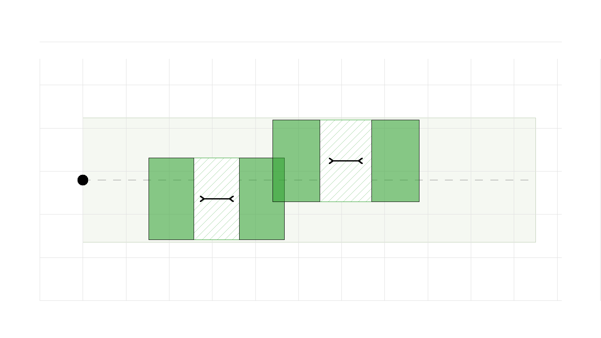

Metadata: runup=0.9, runout=1.3, corridor_half_width=0.72

| obstacle | type | base_position | size | motion |
|---|---|---|---|---|
| `double_gap_entry` | `shifting_gap` | `[1.55, -0.22, 0.1]` | `[0.52, 0.95, 0.1]` | `axis=x, amp=[0.04, 0.12], freq=[0.05, 0.18]` |
| `double_gap_exit` | `shifting_gap` | `[3.05, 0.22, 0.1]` | `[0.55, 0.95, 0.1]` | `axis=x, amp=[0.04, 0.12], freq=[0.05, 0.22]` |

## pure_ramp

### Layout 0: `soft_ramp_course` (easy)

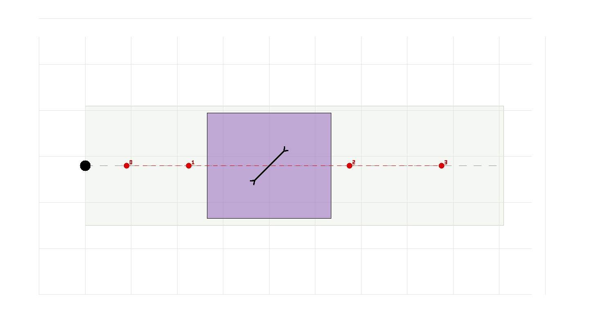

Metadata: runup=1.0, runout=1.2, corridor_half_width=0.65

| obstacle | type | base_position | size | motion |
|---|---|---|---|---|
| `ramp_soft` | `time_varying_ramp` | `[2.0, 0.0, 0.12]` | `[1.35, 1.15, 0.045]` | `axis=pitch, amp=[0.03, 0.1], freq=[0.05, 0.18]` |

### Layout 1: `steep_ramp_course` (medium)

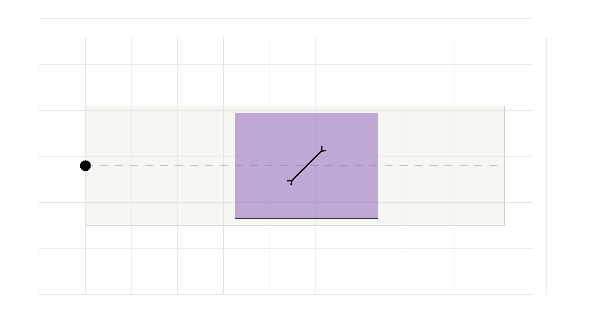

Metadata: runup=0.95, runout=1.25, corridor_half_width=0.65

| obstacle | type | base_position | size | motion |
|---|---|---|---|---|
| `ramp_steep` | `time_varying_ramp` | `[2.4, 0.0, 0.14]` | `[1.55, 1.15, 0.045]` | `axis=pitch, amp=[0.06, 0.18], freq=[0.08, 0.25]` |

### Layout 2: `reverse_down_ramp_course` (hard)

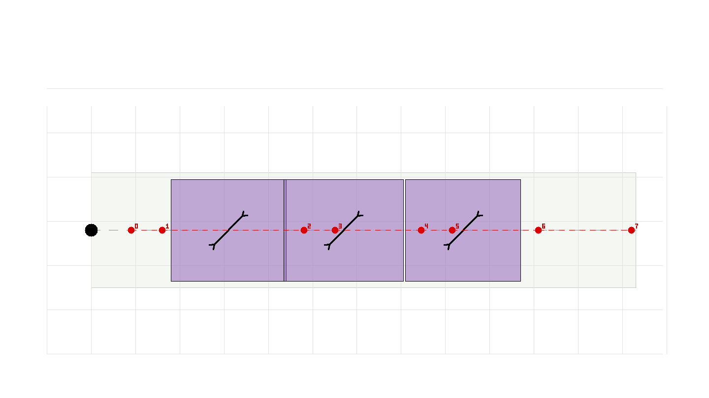

Metadata: runup=0.95, runout=1.25, corridor_half_width=0.65

| obstacle | type | base_position | size | motion |
|---|---|---|---|---|
| `ramp_reverse` | `time_varying_ramp` | `[2.3, 0.0, 0.12]` | `[1.5, 1.15, 0.045]` | `axis=pitch, amp=[0.04, 0.14], freq=[0.05, 0.2]` |

### Layout 3: `tilted_ramp_pair_course` (hardest)

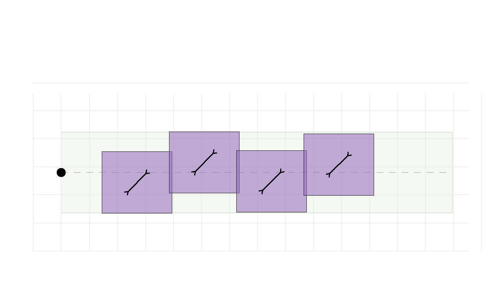

Metadata: runup=0.9, runout=1.35, corridor_half_width=0.72

| obstacle | type | base_position | size | motion |
|---|---|---|---|---|
| `ramp_pair_up` | `time_varying_ramp` | `[1.75, -0.18, 0.12]` | `[1.25, 1.1, 0.045]` | `axis=pitch, amp=[0.03, 0.12], freq=[0.06, 0.2]` |
| `ramp_pair_down` | `time_varying_ramp` | `[3.05, 0.18, 0.12]` | `[1.25, 1.1, 0.045]` | `axis=pitch, amp=[0.04, 0.14], freq=[0.06, 0.22]` |

## mixed

### Layout 0: `hurdle_step_ramp_course` (medium)

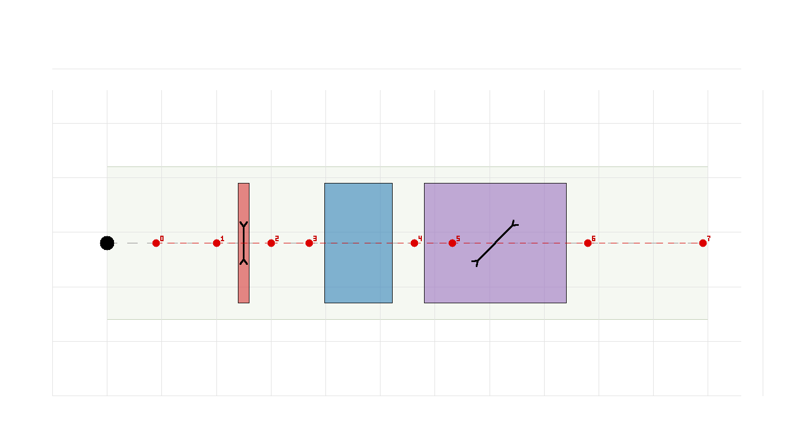

Metadata: runup=0.95, runout=1.25, corridor_half_width=0.7

| obstacle | type | base_position | size | motion |
|---|---|---|---|---|
| `mixed_hurdle_entry` | `moving_hurdle` | `[1.25, 0.0, 0.31]` | `[0.1, 1.1, 0.31]` | `axis=y, amp=[0.07, 0.18], freq=[0.08, 0.24]` |
| `mixed_step_mid` | `changing_step_height` | `[2.3, 0.0, 0.18]` | `[0.62, 1.1, 0.18]` | `axis=z, amp=[0.02, 0.08], freq=[0.06, 0.2]` |
| `mixed_ramp_exit` | `time_varying_ramp` | `[3.55, 0.0, 0.12]` | `[1.3, 1.1, 0.045]` | `axis=pitch, amp=[0.03, 0.12], freq=[0.06, 0.22]` |

### Layout 1: `gap_landing_step_ramp_course` (hard)

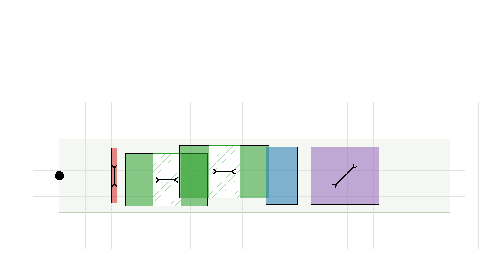

Metadata: runup=0.95, runout=1.3, corridor_half_width=0.7

| obstacle | type | base_position | size | motion |
|---|---|---|---|---|
| `course_takeoff_gap` | `shifting_gap` | `[1.6, 0.0, 0.1]` | `[0.52, 1.1, 0.1]` | `axis=x, amp=[0.04, 0.12], freq=[0.05, 0.18]` |
| `course_landing_step` | `changing_step_height` | `[2.95, 0.0, 0.2]` | `[0.6, 1.1, 0.18]` | `axis=z, amp=[0.02, 0.09], freq=[0.06, 0.22]` |
| `course_exit_ramp` | `time_varying_ramp` | `[4.2, 0.0, 0.12]` | `[1.3, 1.1, 0.045]` | `axis=pitch, amp=[0.04, 0.14], freq=[0.06, 0.22]` |

### Layout 2: `hurdle_gap_staircase_ramp_course` (hardest)

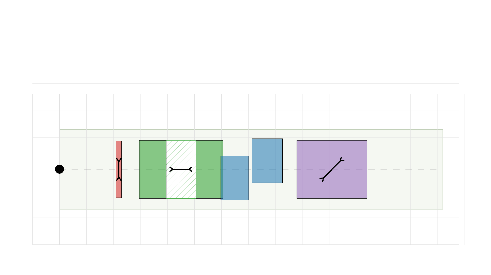

Metadata: runup=0.9, runout=1.35, corridor_half_width=0.74

| obstacle | type | base_position | size | motion |
|---|---|---|---|---|
| `full_course_hurdle` | `moving_hurdle` | `[1.1, 0.0, 0.32]` | `[0.1, 1.05, 0.3]` | `axis=y, amp=[0.06, 0.18], freq=[0.08, 0.24]` |
| `full_course_gap` | `shifting_gap` | `[2.25, 0.0, 0.1]` | `[0.5, 1.08, 0.1]` | `axis=x, amp=[0.04, 0.14], freq=[0.05, 0.18]` |
| `full_course_stair_1` | `changing_step_height` | `[3.25, -0.16, 0.14]` | `[0.52, 0.82, 0.14]` | `axis=z, amp=[0.02, 0.09], freq=[0.06, 0.22]` |
| `full_course_stair_2` | `changing_step_height` | `[3.85, 0.16, 0.24]` | `[0.56, 0.82, 0.24]` | `axis=z, amp=[0.02, 0.09], freq=[0.06, 0.22]` |
| `full_course_ramp` | `time_varying_ramp` | `[5.05, 0.0, 0.12]` | `[1.3, 1.08, 0.045]` | `axis=pitch, amp=[0.03, 0.12], freq=[0.05, 0.2]` |
